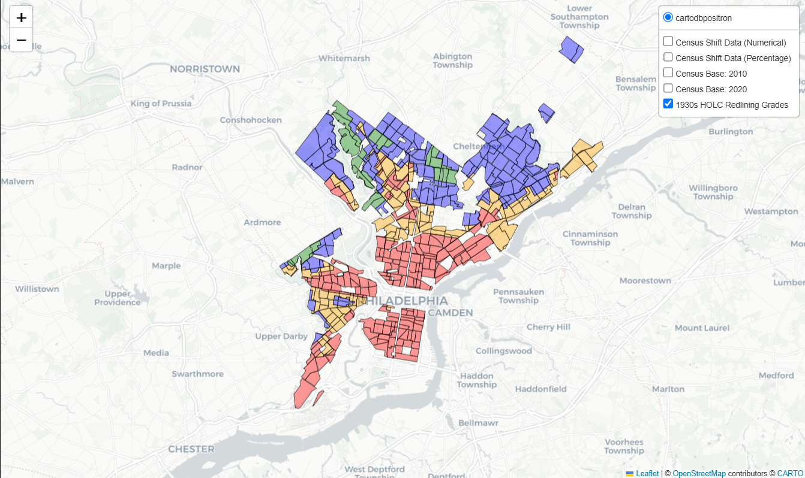
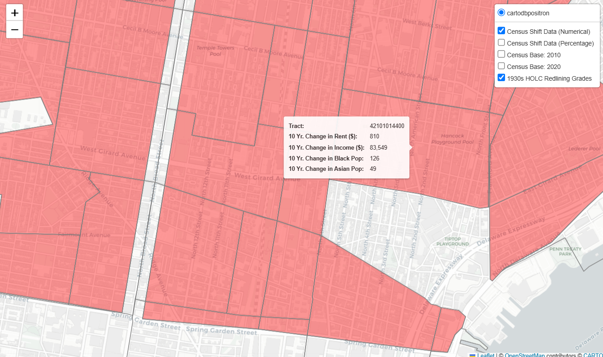
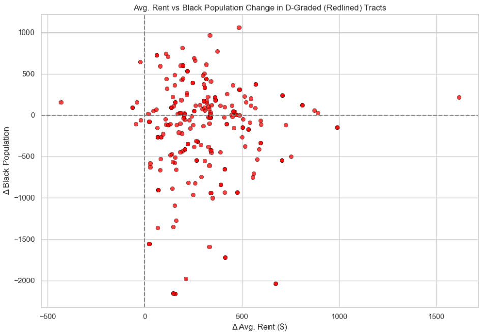
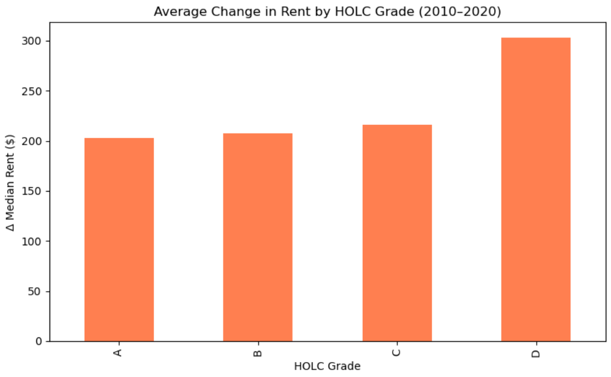
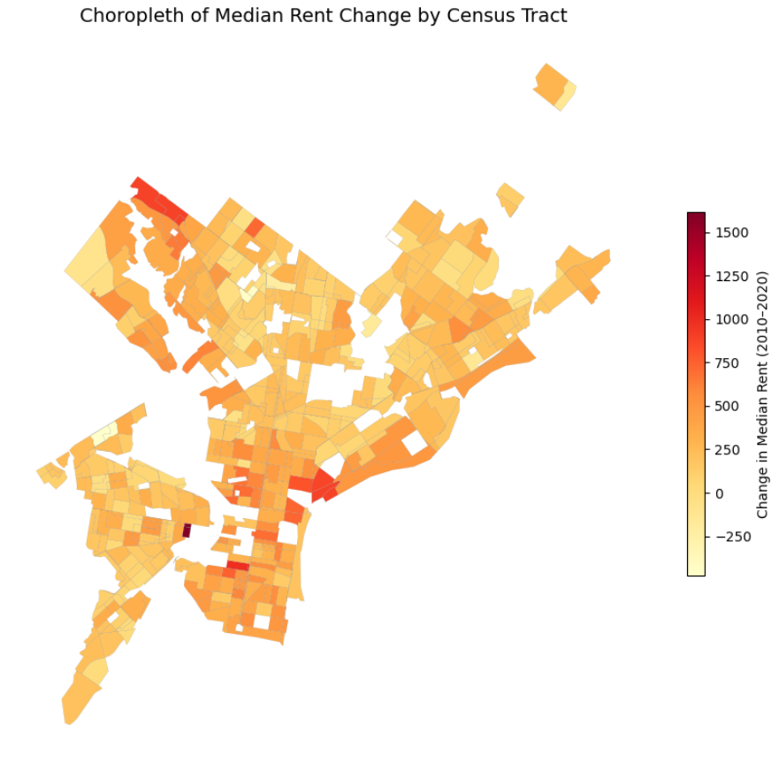

# first-year-coding
Simulations, models, and visualizations from a first-year Physics, Economics & Mathematics student

Despite receiving a D+ in my introduction Python class at Drexel, I have been coding in Python, Java, and Go for years, even receiving a 5 on the AP CS A exam.
Since arriving at Drexel, I have been programming computational physics simulations, small Python assignments, and personal projects that reflect both my academic and personal interests.

## Featured Project

### Displacement & Reverse Redlining in Philadelphia
A data-driven, interactive map visualizing how historical redlining and modern gentrification overlap in Philadelphia. Built using U.S. Census, HOLC, and Eviction Lab data, the tool explores systemic housing inequality— especially in neighborhoods like in North, South, and West Philadelphia.

N.B. I built this program to build off the research paper I submitted to Drexel's student research anthology in my Fall term. Both as someone from North Philadelphia and as a human, I think it is our responsibility to address the current process of gentrification and displacement in our home. **The first step is simply seeing it.**
- [View the map](./reverse_redlining/reverse_redlining.ipynb)
- [Read the essay](./reverse_redlining/Redlining_Essay_and_Displacement_Context_TobiasSafie.pdf)
- [Read about the Displacement Tool](./reverse_redlining/README.MD)

---

### Interactive Map Snapshots

#### HOLC Redlining Map of Philadelphia (1930s)

#### Tract-level data popup (Northern Liberties)

#### Tract-level data popup (West Philly)

---

### Data Visualizations from the Map

#### Rent Change vs Black Population Change in D-Graded (Redlined) Tracts

In formerly redlined (D-graded) areas, rent rises often coincide with significant drops in Black population, suggesting direct displacement.

#### Average Rent Change by HOLC Grade (2010–2020)

D-graded areas— once starved of investment —now have the largest rent increases, underscoring the direct outcomes of reverse redlining.

#### Choropleth: Rent Change by Census Tract

This choropleth gives a citywide view of how deeply rent increases have affected Philadelphia. The darkest reds mark neighborhoods under the highest displacement pressure. 
  N.B. The darkest red spot is around 38th & Walnut, which is predominantly inhabited by UPenn and Drexel students.

---

## Physics Simulations
I made these in the following core Physics courses at Drexel: Contemporary Physics I, II, III, and Computational Physics I. These projects were developed using Jupyter Notebooks and VPython to model real physical systems. Jupyter allowed for interactive, step-by-step development, while VPython made it easy to animate and actually visualize 3D simulations.

### Einstein Solid Model
Simlates energy distribution in a two-particle Einstein solid using discrete energy quanta, Includes entropy calculations, multiplicity tracking, and optional plots to visualize system behavior over time.
- [einstein_solid.ipynb](./physics_simulations/einstein_solid.ipynb)

### E-Field Simulator
Simulates and models the electric field generated by a charged ring, disk, and parallel-plate capacitor using VPython. Users can click to set observation points and visualize the resulting field vectors.
(N.B. The simulation is slow and runs a little funky due to VPython's constraints. Could be further optimized to run more efficiently)
- [efield_simulator.ipynb](./physics_simulations/efield_simulator.ipynb)

### Three Body Problem
Numerically simulates the gravitational interaction between three celestial bodies. Users can click to set the inital position of the third body to begin the simulation.
- [three_body.ipynb](./physics_simulations/three_body.ipynb)

## Short Python Assignments
I coded a handful of short assignments in my intro Python class at Drexel, and although not very impressive, I figured I'd showcase some of the basic key concepts we covered.

### Moon Landing Game
A text-based physics game where players attempt to land safely on various planets with differing gravity values. The main challenge is managing velocity and fuel through user input in real-time. Designed to practice loops, conditionals, and user interaction while incorporating some application of practical and very, very basic physics concepts.
- [lander_game.py](./python_assignments/lander_game.py)

### Recipe Assistant
A utility that reads .csv files containing nutritional information and recipes to generate per-serving nutrition labels. The assignment focused on working with dictionaries, file I/O, and handling incomplete data gracefully.
- [recipe_assistant.py](./python_assignments/recipe_assistant.py)

### The Game of War
A simple program that employs recursion to simulate the card game of War. The primary guideline of the assignment was to use recursion instead of game loops.
- [war.py](./python_assignments/war.py)

- ## Personal Projects
As of right now, I am taking Computational Physics I and completing two to three more computational physics simulations every week in my core Physics course. I don't have any big plans for personal projects for the Spring term besides continuing the displacement map, but, to be honest, I'm waiting for my next idea.

### Flappy Bird
A rough recreation of Flappy Bird. It features my own 3D models and incorporates realistic gravity (negligible drag and arbitrary impulse-based lift).
N.B. I made this during my Fall term to help familiarize myself with VPython.
- [flappy_bird.ipynb](./[personal_projects/flappy_bird.ipynb)

