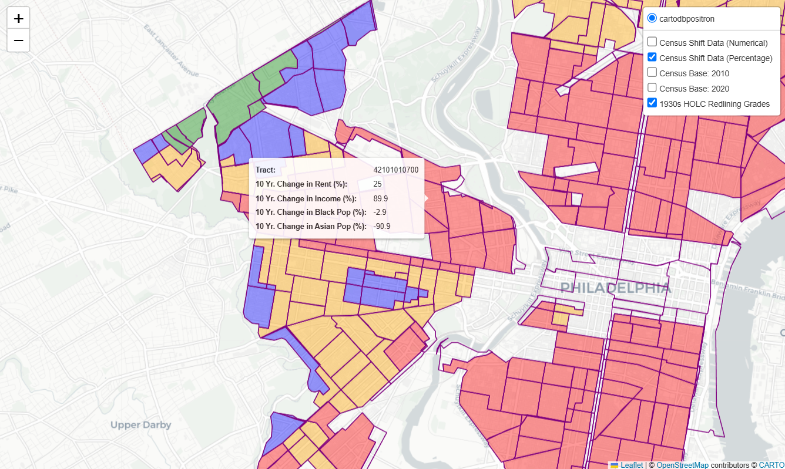
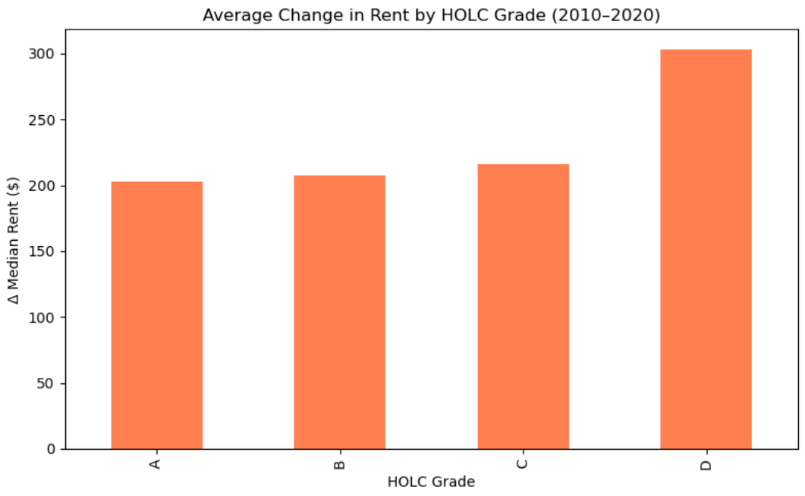
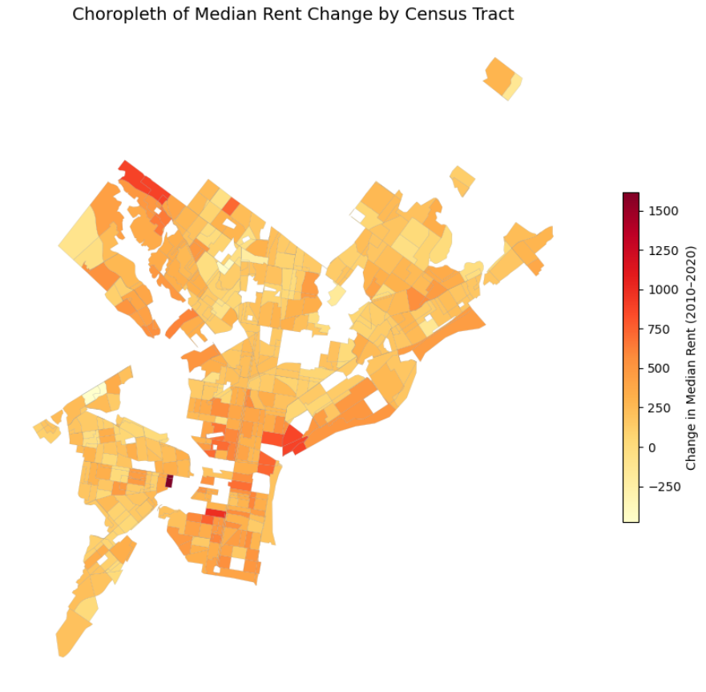
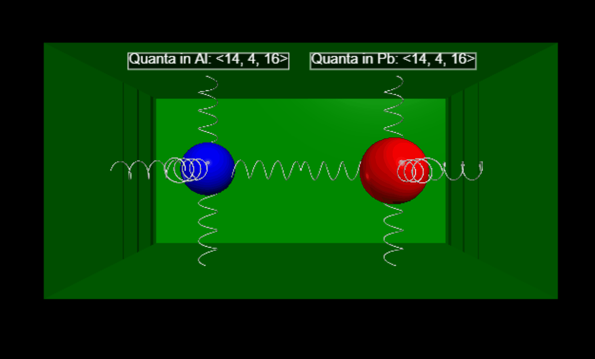
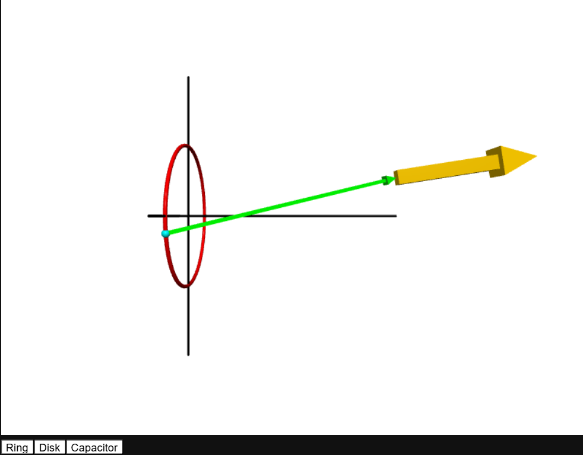
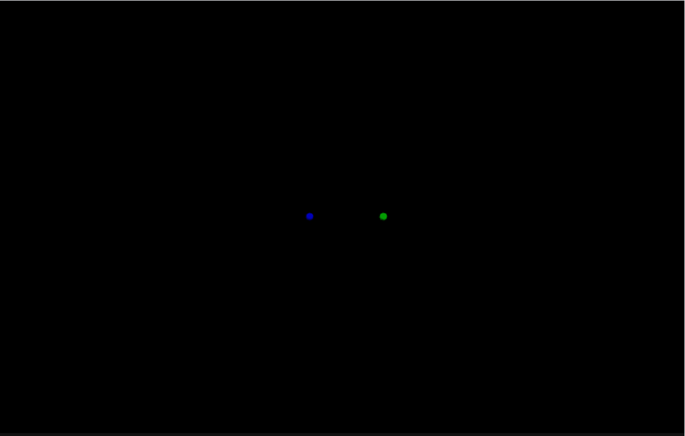

# first-year-coding
Simulations, models, and visualizations from a first-year Physics, Economics & Mathematics student

Despite receiving a less-than-representative grade in my introduction Python class at Drexel, I have been coding in Python, Java, and Go for years, even receiving a 5 on the AP CS A exam.
Since arriving at Drexel, I have been programming computational physics simulations, short Python programs, and personal projects that reflect both my academic and personal interests.

## Featured Projects

### Displacement & Reverse Redlining in Philadelphia
A data-driven, interactive map visualizing how historical redlining and modern gentrification overlap in Philadelphia. Built using U.S. Census, HOLC, and Eviction Lab data, the tool explores systemic housing inequality— especially neighborhoods in North, South, and West Philadelphia.

N.B. I built this program to build off the research paper I submitted to Drexel's student research anthology in my Fall term. Both as someone from North Philadelphia and as a human, I think it is our responsibility to address the current process of gentrification and displacement in our home. **The first step is simply seeing it.**
- [View the code](./reverse_redlining/reverse_redlining.ipynb)
- [Read the essay](./reverse_redlining/Redlining_Essay_and_Displacement_Context_TobiasSafie.pdf)
- [About the Displacement Tool](./reverse_redlining/README.MD)

---

### Displacement Map Snapshot

---

### Data Visualizations from the Displacement Tool

  
  

---

### Quantitative Trading Simulator
A modular backtester and interactive trading game supporting technical indicators like MACD, RSI, and ATR-based strategies. Designed for strategy development, visualization, and user experimentation. This project marked my first deep dive into algorithmic trading and quantitative financial modeling.

## Physics Simulations
I made these in the following core Physics courses at Drexel: Contemporary Physics I, II, III, and Computational Physics I. These projects were developed using Jupyter Notebooks and VPython to model real physical systems. Jupyter allowed for interactive, step-by-step development, while VPython made it easy to animate and actually visualize 3D simulations.

### Einstein Solid Model
Simlates energy distribution in a two-particle Einstein solid using discrete energy quanta, Includes entropy calculations, multiplicity tracking, and optional plots to visualize system behavior over time.
- [einstein_solid.ipynb](./physics_simulations/einstein_solid.ipynb)

### E-Field Simulator
Simulates and models the electric field generated by a charged ring, disk, and parallel-plate capacitor using VPython. Users can click to set observation points and visualize the resulting field vectors.
(N.B. The simulation is slow and runs a little funky due to VPython's constraints. Could be further optimized to run more efficiently)
- [efield_simulator.ipynb](./physics_simulations/efield_simulator.ipynb)

### Three Body Problem
Numerically simulates the gravitational interaction between three celestial bodies. Users can click to set the inital position of the third body to begin the simulation.
- [three_body.ipynb](./physics_simulations/three_body.ipynb)

- ## Personal Projects
As of right now, I am taking Computational Physics I and completing two to three more computational physics simulations every week in my core Physics course. For the rest of the school year I will be making a few models and immersing myself in machine learning.

### Flappy Bird
A rough recreation of Flappy Bird. It features my own 3D models and incorporates realistic gravity (albeit negligible drag and arbitrary impulse-based lift).
N.B. I made this during my Fall term to help familiarize myself with VPython.
- [flappy_bird.ipynb](./[personal_projects/flappy_bird.ipynb)

