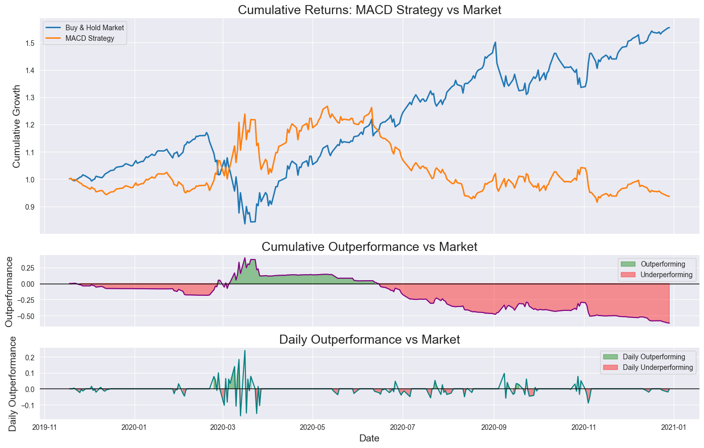
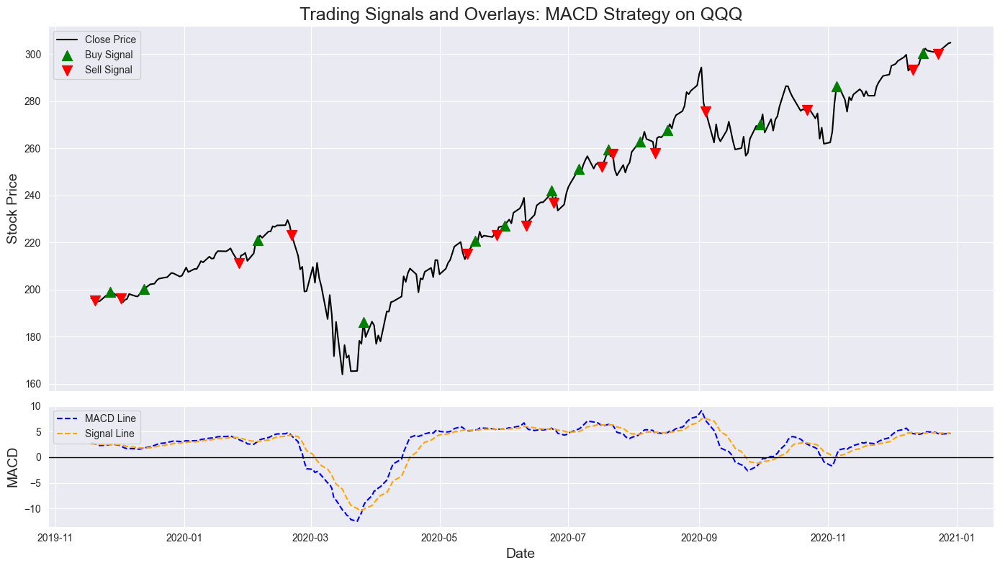
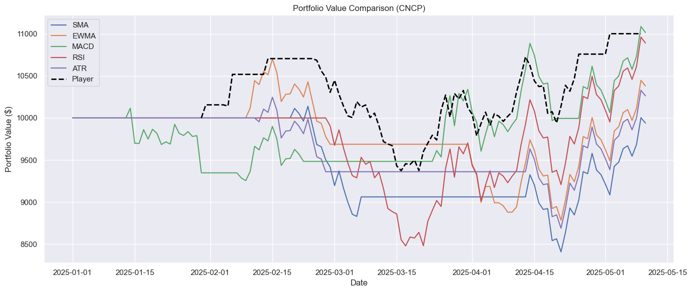
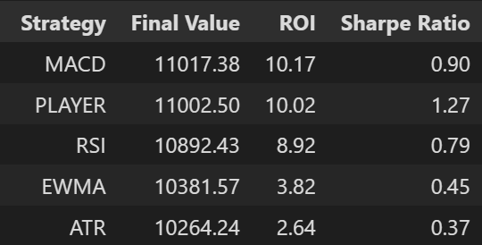

# **Capstone Quantitative Trading Strategy Lab**

A modular Python trading simulator that combines a backtesting engine with an interactive trading game. Supports technical indicators including MACD, RSI+Bollinger, and ATR Breakout. Built for experimentation, visualization, and foundational learning in algorithmic trading and quantitative modeling.

---

## **Features**

- Backtesting engine for historical equity data
- Interactive game mode that simulates live trading decisions
- Plug-and-play architecture for new or custom indicators
- Clear trade signal visualizations over price data
- Basic performance tracking and return analytics

---

## **Project Structure**

```bash
capstone/
├── Capstone_Backtester.ipynb        # Core backtesting logic
├── Capstone_Game.ipynb              # Interactive simulation game
├── game_scripts/                    # Modular scripts for game logic and mechanics
│   └── ...
├── strategies/                      # Custom trading algorithms and indicators
│   └── ...
├── media/                           # Screenshots, plots, and visualizations
│   └── ...
├── dev_notebooks/                   # Experimental notebooks for indicator and model development
│   └── ...
├── requirements.txt                 # Python dependencies
└── README.md                        # This file
```

---

## **Visualizations from the Game and Backtester**
<p align="center">


</p>

---

<p align="center">


</p>

---

## **How to Run**

[Open In Colab](https://colab.research.google.com/drive/16qPvm1POVvRglkQbFm_FPXL2DidPPvi8?usp=sharing)

OR:

```bash
# Clone the repository
git clone https://github.com/tobiassafie/first-year-coding.git
cd first-year-coding/finance_model/capstone

# Install dependencies
pip install -r requirements.txt

# Run the backtester
python Capstone_Backtester.ipynb  # or run in Jupyter Lab/Notebook

# Run the game simulation
python Capstone_Game.ipynb  # or run in Jupyter Lab/Notebook
```

---

## **Why This Exists**
This project was built to explore the foundations of quantitative trading through simulation and backtesting. I wanted to dip my feet in the water into algorithmic trading and quant finance and I figured this was the perfect project to do it. With these tools, you can test technical strategies, experiment with modular indicators, or simply try to beat the market in a game I made. They werre designed to hone both the creator's and the user's skillsets.
